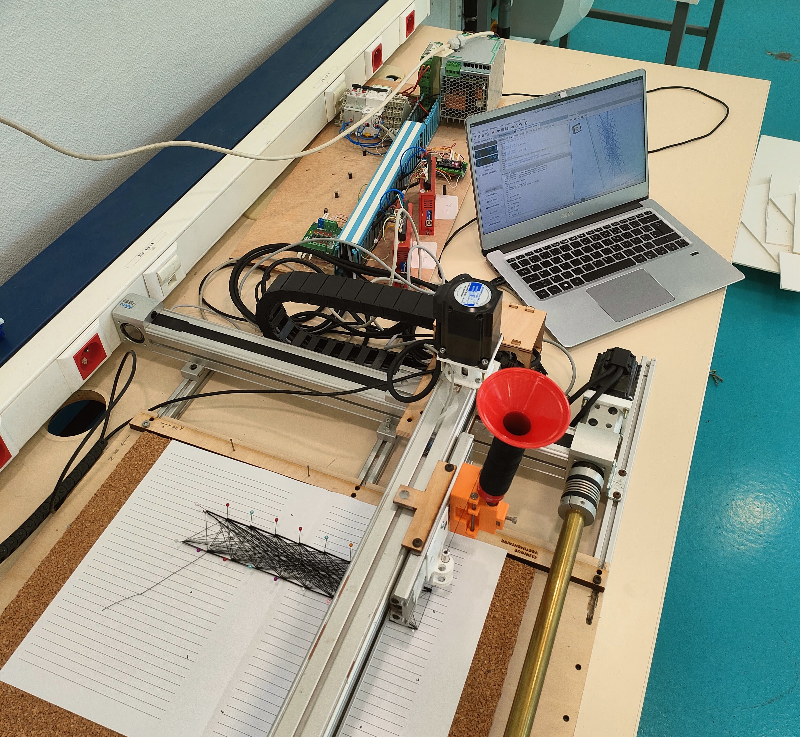

# PIE Tricotissage 2024-2025



#### Membres de l'équipe 

- Mohamed Salim Ben Noomen
- Pierre Bordeau
- Élodie De Brito
- Auriane Martel
- Adrien Scarfoglière

## Présentation

Ce PIE consiste en l'amélioration d'une machine de tricotissage existante. La machine est pilotée avec une carte Arduino Nano sur laquelle tourne une version légèrement modifiée de [Grbl](https://github.com/gnea/grbl).

Nous avons entièrement réécrit les programmes permettant de générer le GCode à envoyer à la machine. Les programmes Python permettent de générer à partir d'une image un schéma de tricotissage (position des aiguilles des différents groupes), puis de générer les programmes GCode de marquage et de tricotissage.

Les Programmes GCode peuvent être envoyés à la machine via le logiciel [UGS](https://winder.github.io/ugs_website/).

## Architecture du dépôt 

- `detpts/` : Contient les fonctions de détections de points afin de placer les aiguilles
- `grbl/` : Contient les codes sources Grbl modifiés pour la machine (notamment pour l'ajout du servomoteur pour le marquage). Ce dossier doit être copié dans le répertoire des librairies d'Arduino IDE pour ensuite être envoyé à l'Arduino s'il s'agit d'une nouvelle carte Arduino.
- `interface/` : Contient le code de l'interface utilisateur
- `prgs_gcode/` : Contient les fichiers GCode à envoyer à la machine
- `pts2gcode/` : Contient le code de création des fichiers d'instructions Gcode
- `yaml_files/` : Contient les fichiers correspondant aux schémas de tricotissage, au format YAML
- Le fichier `firmware_grbl.settings` contient les paramètres de la machine, à envoyer à l'Arduino via UGS s'il s'agit d'une nouvelle carte Arduino.
- Le fichier `requirements.txt` contient les dépendances python pour faire fonctionner le projet


## Utilisation

On installe les dépendances python avec, depuis la racine du repository : 
```
$pip install -r requirements.txt
```

On lance l'interface utilisateur : 
```
$cd interface
$python appli.py
```